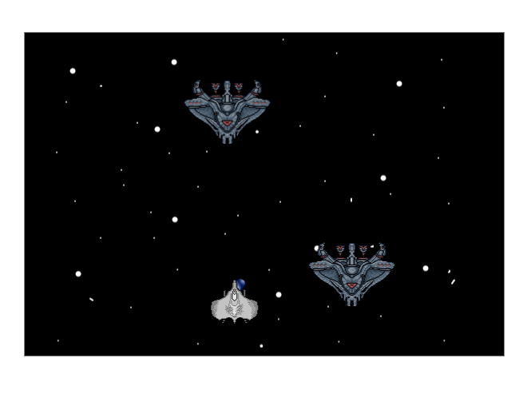

# Spaceship
A small spaceships game written in JS using [easelJS](https://www.createjs.com/easeljs) library:

To execute it, you will need some kind of live server, the one that's an extension of VS Code can come in handy for the task. After that, simply open the `index.html` file and you are good to go.

Please, feel free to adapt its code and use it for your own purposes.